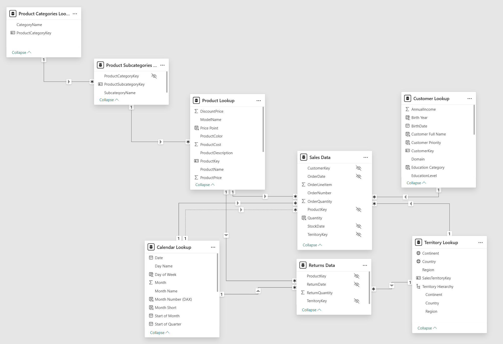
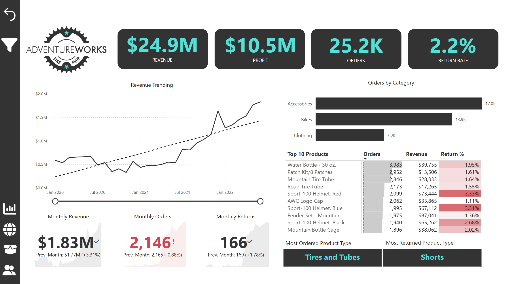
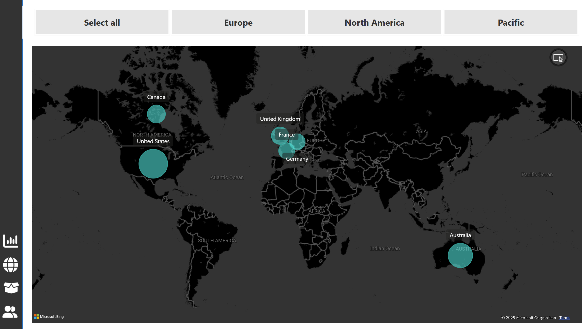
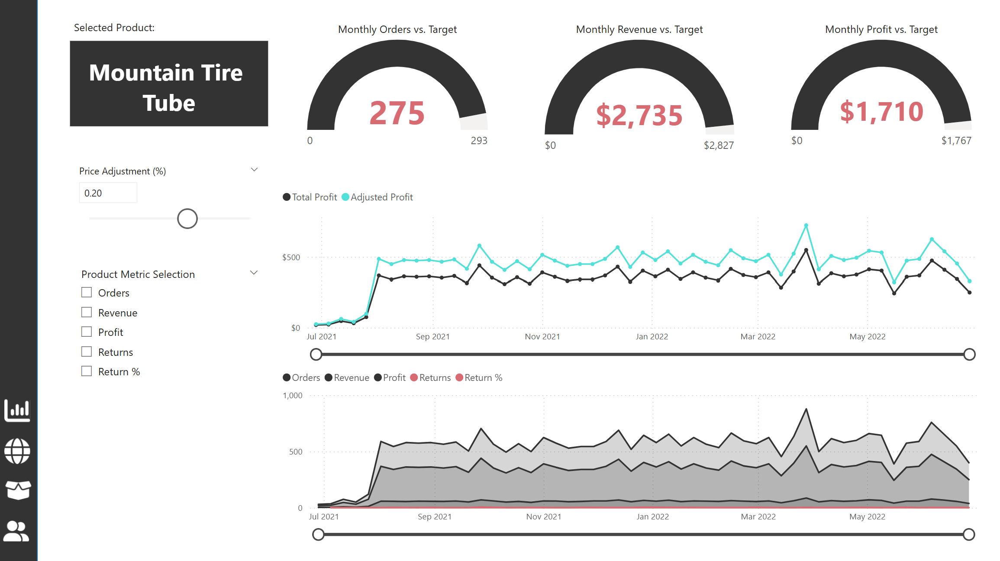
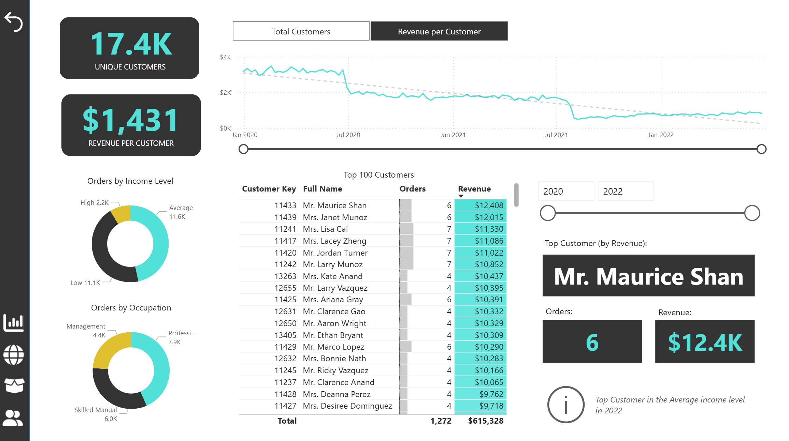

# AdventureWorks Sales Dashboard
Dashboard created with Microsoft’s official sample dataset - AdventureWorks, which covers sales, customers, location, products and more.

## Dataset overview

The dataset contains 12 dimension CSV files about dates, customers, products, returns, locations, and 3 about sales data from 2020 to 2022.

**Fact tables:**
- Sales Data
- Returns data

**Lookup tables:**
- Product Categories Lookup
- Product Subcategories Lookup
- Product Lookup
- Calendar Lookup
- Customer Lookup
- Territory Lookup

**Data model:**

## Dashboard

The dashboard contains 4 pages, with the executive dashboard displaying the main information regarding sales, profits, orders, returns, and top products. Map, Product Detail, and Customer Detail display in-depth insights about their respective areas. Sidebar for easy navigation between the pages.

**Executive dashboard:**
- Key KPI cards about total sales, profit, orders, and return rate.
- Best performed product categories with bar charts.
- Line chart of revenue trend with the ability to drilldown from year to quarter and month.
- Table of top 10 products and their respective orders and revenue.

**Map page:**
- Displays total orders with filters of the three continents the company operates in: North America, Europe, and Pacific.

**Product Detail page:**
- Gauge charts showing targets of revenue, profit, and orders. Dynamic formatting depending on whether the target has been surpassed or not for easier visualization.
- Multiple line chart showing difference between profit and adjusted profit over time.
- Price adjustment slider and product metric selection pane to narrow down the effects of price experimentation.

**Customer detail page:**
- KPI cards to display number of customers and revenue per customer.
- Line chart for customer trend throughout the three years.
- Table of top 100 customers and cards focusing on the highest spending customer in the period filtered.
- Donut charts showing distribution of orders by income level and occupation.

